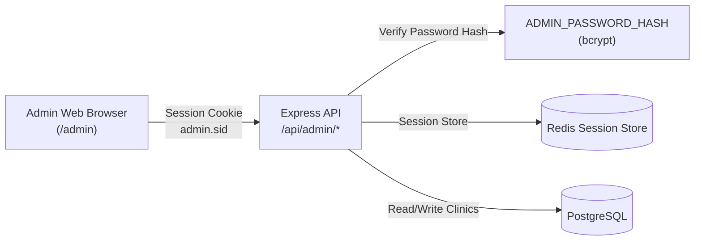
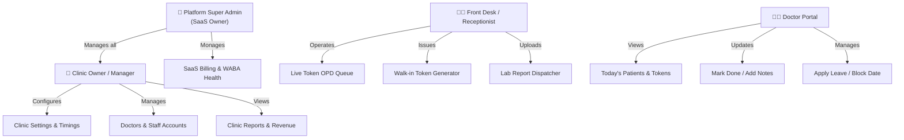
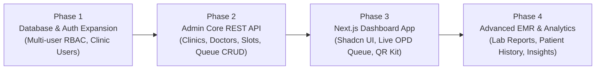

# Admin Architecture, Capabilities & Modern Dashboard Roadmap

## 1. Executive Summary & Vision

The **WhatsApp Appointment Platform** is built on a "WhatsApp-first" philosophy: patients and staff interact primarily through natural text messages on WhatsApp. However, managing multi-clinic operations, live patient queues, doctor rosters, medical reports, and platform billing at scale requires a dedicated **Web Admin & Management Dashboard**.

This document breaks down:
1. **What we currently have**: Existing endpoints, auth mechanism, and capabilities.
2. **What is missing**: Gaps compared to modern healthcare SaaS products (Practo, Doctolib, Zocdoc, Wati/Gallabox healthcare CRM).
3. **What we should build**: Target architecture, multi-tier RBAC (Super Admin vs Clinic Manager vs Receptionist vs Doctor), Next.js modern frontend, real-time live OPD queue, and full API specifications.

---

## 2. Current State: What We Have Today

### 2.1 Current Admin Stack & Mechanism


- **Authentication**: Single global admin password verified using `bcrypt.compare()` against `ADMIN_PASSWORD_HASH` stored in `.env`.
- **Session Management**: `express-session` backed by Redis (`connect-redis`), issuing an `admin.sid` HTTP-only, secure cookie with 12-hour expiration.
- **Brute-force Protection**: `login-rate-limit.ts` (in-memory rate limiter, max 5 attempts per 15 minutes per IP).
- **UI Implementation**: Static single-page HTML file at `public/admin/index.html` (vanilla JS + CSS variables + responsive dark/light mode).

### 2.2 Available Endpoints & Capabilities Today

| Method | Endpoint | Access | What it Does Today |
|---|---|---|---|
| `POST` | `/api/admin/login` | Public | Validates single admin password, mints Redis session |
| `POST` | `/api/admin/logout` | Authenticated | Destroys current admin session |
| `GET` | `/api/admin/tenants` | Authenticated | Lists all clinics with WhatsApp numbers, `wa.me` links, QR endpoints, and reminder toggle states |
| `PATCH` | `/api/admin/tenants/:id/settings` | Authenticated | Toggles `remindersEnabled` and `notificationsEnabled` kill-switches per clinic |
| `GET` | `/api/admin/tenants/:id/qr` | Authenticated | Returns structured QR metadata & base64 Data URL |
| `GET` | `/api/admin/tenants/:id/qr/download` | Authenticated | Downloads high-resolution PNG (up to 4000px) or vector SVG QR code |
| `GET` | `/qr/:tenantId` / `/poster` | Public | Serves interactive web preview & print-ready A4 counter standee flyer |
| `GET` | `/qr/:tenantId/image` | Public | Streams PNG/SVG directly for website embeds and flyers |

### 2.3 Current Limitations
1. **Single Global User**: Only 1 super-admin exists. Clinics cannot log in to see only *their own* clinic's data.
2. **Read-Only Clinic Metadata**: Cannot create a new clinic, edit clinic name, change phone number, or adjust timezones from the UI (must run seed scripts or SQL).
3. **Zero Doctor / Staff Management**: Cannot add doctors, set consult fees, change durations, or view doctor profiles.
4. **Zero Visual Schedule / Calendar**: Doctors' available slots and leaves are only editable through text commands on WhatsApp (`BLOCK`, `SLOT`).
5. **No Live OPD Queue / Waiting Room**: Receptionists cannot see live tokens, patient arrival status, waiting times, or call the next token from a computer screen.
6. **No Patient Records / Lab Reports View**: Cannot view patient history, past visits, or track PDF report upload statuses.
7. **No Analytics**: No insights into appointment volumes, peak booking hours, no-show rates, or Meta API utility costs.

---

## 3. What We Are Missing: Industry Standard Comparison

Modern healthcare management platforms (like Practo Ray, Doctolib, and Zocdoc) use a **Hybrid WhatsApp + Web Dashboard** model. WhatsApp is the communication channel; the web dashboard is the operational command center.

| Feature Area | Modern Healthcare Standard | What We Currently Have | Priority |
|---|---|---|---|
| **Multi-Tenancy & RBAC** | Multi-role logins (Super Admin, Clinic Owner, Receptionist, Doctor) | 1 shared Super Admin password | **P0 (Critical)** |
| **Live OPD Queue / Token Display** | Real-time Kanban / table showing Waiting, In-Consultation, Completed, No-Show + TV Waiting Room Display | Text command `TODAY` on WhatsApp | **P0 (Critical)** |
| **Walk-in + WhatsApp Sync** | Receptionist creates walk-in token on dashboard; auto-syncs with WhatsApp token counter | WhatsApp only | **P0 (Critical)** |
| **Doctor Roster & Leave Manager** | Visual weekly schedule builder, slot duration adjuster, 1-click leave calendar | Plain text `SLOT` & `BLOCK` commands | **P1 (High)** |
| **Patient Directory (EMR-Lite)** | Searchable patient list, visit history, chief complaints, prescription/report history | Scattered across DB tables | **P1 (High)** |
| **Report & PDF Dispatcher** | Drag-and-drop PDF upload to send lab reports to patient WhatsApp with delivery receipts | Send PDF with caption `REPORT <phone>` via WhatsApp | **P1 (High)** |
| **Broadcast & Announcements** | Send holiday/emergency notices to patients booked for a given day | None | **P2 (Medium)** |
| **Analytics & Financials** | Daily patient footfall, doctor occupancy %, no-show rate, WhatsApp utility message costs | None | **P2 (Medium)** |

---

## 4. Proposed User Roles & Access Control (RBAC)



### 1. Platform Super Admin (SaaS Owner)
- Create and onboard new clinics.
- Configure Meta WABA credentials, phone number IDs, and webhook health.
- Global messaging usage & costs monitor.
- System-wide toggle switches and audits.

### 2. Clinic Owner / Admin
- Manage clinic profile, address, operating hours, consultation fees.
- Add and manage doctors, receptionists, and user permissions.
- Manage clinic-wide booking settings (booking horizon days, cancellation rules).
- View clinic analytics: total bookings, completion %, revenue, no-show rate.
- Download clinic QR codes, counter standees, and marketing flyers.

### 3. Front Desk / Receptionist
- **Live Waiting Room Queue**: Real-time token board with 1-click status updates (`Arrived`, `In Consultation`, `Completed`, `No Show`).
- **Walk-in Booking**: Create a walk-in token in 5 seconds (assigns next token, sends WhatsApp confirmation to the walk-in patient).
- **Patient Lookup**: Search patient by phone or name, view upcoming & past appointments.
- **Lab Reports**: Drag-and-drop PDF upload with instant WhatsApp delivery to the patient.

### 4. Doctor Portal (Optimized for Tablet & Mobile)
- Streamlined daily schedule view with patient names, age, and chief complaint.
- 1-click `Call Next Patient` / `Mark Done` buttons.
- Quick 1-click leave/block date request.
- Patient history overview for returning patients.

---

## 5. Recommended Frontend Architecture: Modern Next.js Dashboard

To deliver a blisteringly fast, responsive, and enterprise-grade dashboard, we recommend building a dedicated **Next.js (App Router)** admin web application.

```
┌────────────────────────────────────────────────────────┐
│               Next.js 15 (App Router)                  │
│                                                        │
│  ┌──────────────────┐  ┌────────────────────────────┐  │
│  │   Auth & RBAC    │  │       Shadcn UI + Radix    │  │
│  │ (NextAuth / JWT) │  │    Tailwind CSS + Lucide   │  │
│  └──────────────────┘  └────────────────────────────┘  │
│  ┌──────────────────┐  ┌────────────────────────────┐  │
│  │ TanStack Query   │  │  Live Queue WebSockets/SSE │  │
│  │ (Data Fetching)  │  │  (Real-time Token Updates) │  │
│  └──────────────────┘  └────────────────────────────┘  │
└───────────────────────────▲────────────────────────────┘
                            │ REST / SSE API
┌───────────────────────────▼────────────────────────────┐
│          Express 5 Backend (Existing Service)          │
│   /api/v1/auth · /api/v1/clinics · /api/v1/queue       │
└────────────────────────────────────────────────────────┘
```

### Why Next.js + Tailwind + Shadcn UI?
1. **Server Components (RSC)**: Instant initial page loads and secure session handling.
2. **Real-time Live Queue**: Server-Sent Events (SSE) or WebSockets allow the front-desk token queue to update instantaneously without page reloads when patients book via WhatsApp.
3. **Mobile & Tablet Responsive**: Doctors and receptionists can use iPads or smartphones at clinic counters.
4. **Print Optimization**: Built-in CSS print stylesheets for instant Prescription & Token Slips printing.

---

## 6. Comprehensive API Blueprint for the New Admin System

### 6.1 Authentication & Profile (`/api/v1/auth`)
- `POST /api/v1/auth/login`: Email/phone + password or OTP login. Returns JWT and user session.
- `POST /api/v1/auth/refresh`: Refreshes session token.
- `GET /api/v1/auth/me`: Returns current authenticated user, role, and tenant permissions.
- `POST /api/v1/auth/logout`: Clears session token.

### 6.2 Clinic Management (`/api/v1/clinics`)
- `GET /api/v1/clinics`: (Super Admin) Lists all clinics with stats.
- `POST /api/v1/clinics`: (Super Admin) Onboards a new clinic with Meta Phone Number ID.
- `GET /api/v1/clinics/:id`: Clinic details, working hours, and doctor profiles.
- `PATCH /api/v1/clinics/:id`: Updates clinic profile, branding, and timezone.
- `GET /api/v1/clinics/:id/qr`: Returns QR code assets (PNG, SVG, wa.me deep links).

### 6.3 Doctor Roster & Timings (`/api/v1/doctors`)
- `GET /api/v1/doctors?clinicId=...`: Lists doctors for a clinic.
- `POST /api/v1/doctors`: Adds a doctor (specialization, slot duration, consult fee, contact).
- `PATCH /api/v1/doctors/:id`: Updates doctor details or active/inactive status.
- `POST /api/v1/doctors/:id/generate-slots`: Visual slot generator (sets shift times, durations, recurrence).
- `GET /api/v1/doctors/:id/blocked-dates`: Lists doctor leaves / blocked dates.
- `POST /api/v1/doctors/:id/block-date`: Blocks a date, frees unbooked slots, and notifies booked patients over WhatsApp.

### 6.4 Live OPD Queue & Appointments (`/api/v1/queue`)
- `GET /api/v1/queue/today?clinicId=...&doctorId=...`: Returns today's live queue grouped by status (`waiting`, `in-consultation`, `completed`, `noshow`).
- `GET /api/v1/queue/stream`: **Server-Sent Events (SSE)** stream delivering instant queue events (new booking, token marked done, walk-in added).
- `POST /api/v1/queue/walk-in`: Front-desk creates a walk-in token; returns token number and sends WhatsApp receipt to patient.
- `PATCH /api/v1/queue/appointments/:id/status`: Updates token status (`completed`, `noshow`, `in-consultation`).
- `POST /api/v1/queue/appointments/:id/cancel`: Cancels appointment with reason, notifies patient on WhatsApp, frees slot.

### 6.5 Patient Records & Reports (`/api/v1/patients`)
- `GET /api/v1/patients?query=...`: Searches patient directory by phone or name.
- `GET /api/v1/patients/:id`: Patient profile, visit history, and uploaded lab reports.
- `POST /api/v1/reports/upload`: Multipart file upload for PDF lab report $\rightarrow$ enqueues BullMQ delivery job to send via WhatsApp.
- `GET /api/v1/reports?clinicId=...`: Audit log of report delivery statuses (`queued`, `sent`, `failed`).

### 6.6 Analytics & Business Insights (`/api/v1/analytics`)
- `GET /api/v1/analytics/overview?clinicId=...&from=...&to=...`:
  - Total bookings, completion rate, no-show rate.
  - Doctor occupancy percentage.
  - Peak booking hours breakdown.
  - WhatsApp utility message counts and estimated Meta costs.

---

## 7. Key UI Modules to Build in the Dashboard

```
┌────────────────────────────────────────────────────────────────────────┐
│  🏥 Sunrise Clinic       [ Live OPD Queue ]  [ Doctors ]  [ Settings ] │
├────────────────────────────────────────────────────────────────────────┤
│                                                                        │
│  📅 Today: Tue, 18 Aug 2026                 [ + Add Walk-in Patient ]  │
│                                                                        │
│  👨‍⚕️ Filter Doctor: [ Dr. Asha Verma (General Physician) ▼ ]          │
│                                                                        │
│  ┌───────────────────────┐ ┌───────────────────────┐ ┌───────────────┐  │
│  │   WAITING (3)         │ │  IN CONSULTATION (1)  │ │ COMPLETED (8) │  │
│  │ ───────────────────── │ │ ───────────────────── │ │ ───────────── │  │
│  │ #4 Rahul Sharma 09:45 │ │ #3 Amit Roy   09:30   │ │ #1 Priya Das  │  │
│  │    [Call In] [No-Show]│ │    [Mark Completed ✓] │ │    09:00 [✓]  │  │
│  │                       │ │                       │ │ #2 Sunita Sen │  │
│  │ #5 Meera Ali    10:00 │ │                       │ │    09:15 [✓]  │  │
│  │    [Call In] [No-Show]│ │                       │ │               │  │
│  └───────────────────────┘ └───────────────────────┘ └───────────────┘  │
│                                                                        │
│  📺 [ Open Waiting Room TV Display ]    📱 [ Clinic WhatsApp QR Poster ]│
└────────────────────────────────────────────────────────────────────────┘
```

1. **Live OPD Queue Board**: Real-time Kanban board with audio chime when new patients check in.
2. **TV Waiting Room Display Mode (`/tv-display`)**: Full-screen clean token display with "Now Serving Token #X" and voice announcement for waiting room screens.
3. **Doctor Calendar & Timings**: Drag-and-drop weekly timetable editor and 1-click vacation scheduler.
4. **Lab Report Drag-and-Drop Uploader**: Upload PDF, enter phone number, and preview WhatsApp delivery receipt.
5. **Printable Prescription & Token Slips**: 1-click thermal receipt printer format for walk-in tokens.
6. **QR Code & Marketing Kit**: Download ready-to-print acrylic standees, sticker formats, and social media flyers.

---

## 8. Phased Implementation Strategy



### Phase 1: Database & Auth Expansion (Backend)
- Add `email`, `password_hash`, and `is_active` to `users` table.
- Create JWT / Secure Cookie authentication endpoints (`/api/v1/auth/*`).
- Add tenant-scoped authorization middleware (`requireRole(["clinic_admin", "receptionist"])`).

### Phase 2: Core Admin REST API (Backend)
- Implement Doctor management endpoints (CRUD, slot generators, leave manager).
- Implement Live Queue & Walk-in booking endpoints (`/api/v1/queue/*`).
- Implement Server-Sent Events (SSE) for real-time queue synchronization.

### Phase 3: Modern Next.js Dashboard Frontend
- Scaffold Next.js project with Tailwind CSS and Shadcn UI.
- Build Live Queue Kanban / Table view with walk-in token generator.
- Build Doctor Roster and Weekly Schedule editor.
- Build QR Code & Marketing Kit download center.
- Build Fullscreen TV Waiting Room token display.

### Phase 4: Patient EMR-Lite & Analytics
- Searchable patient directory and past appointment history.
- Web-based Lab Report PDF upload and delivery tracker.
- Analytics charts (patient footfall, peak hours, no-show trends, Meta billing stats).
