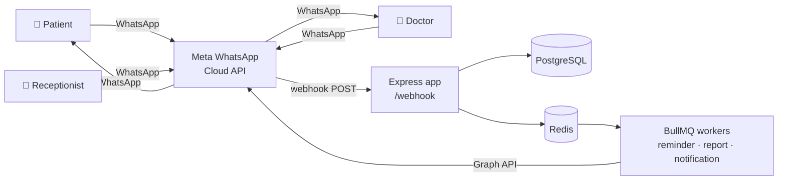
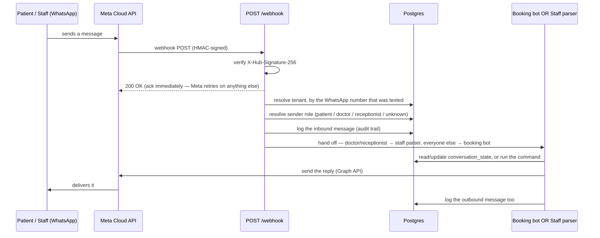
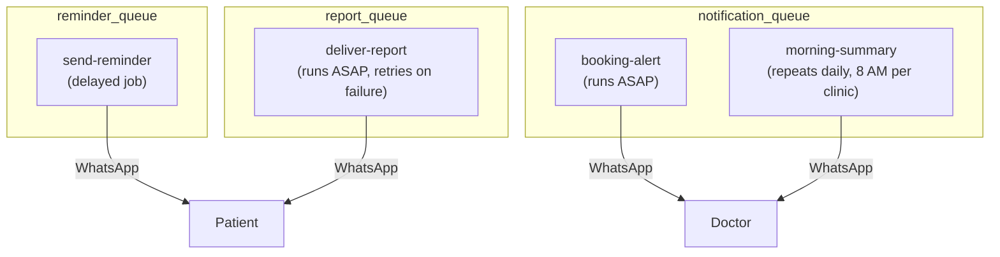
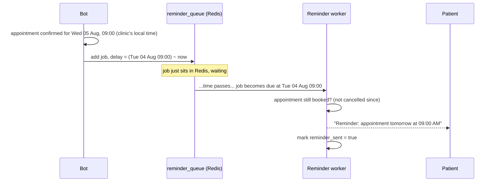
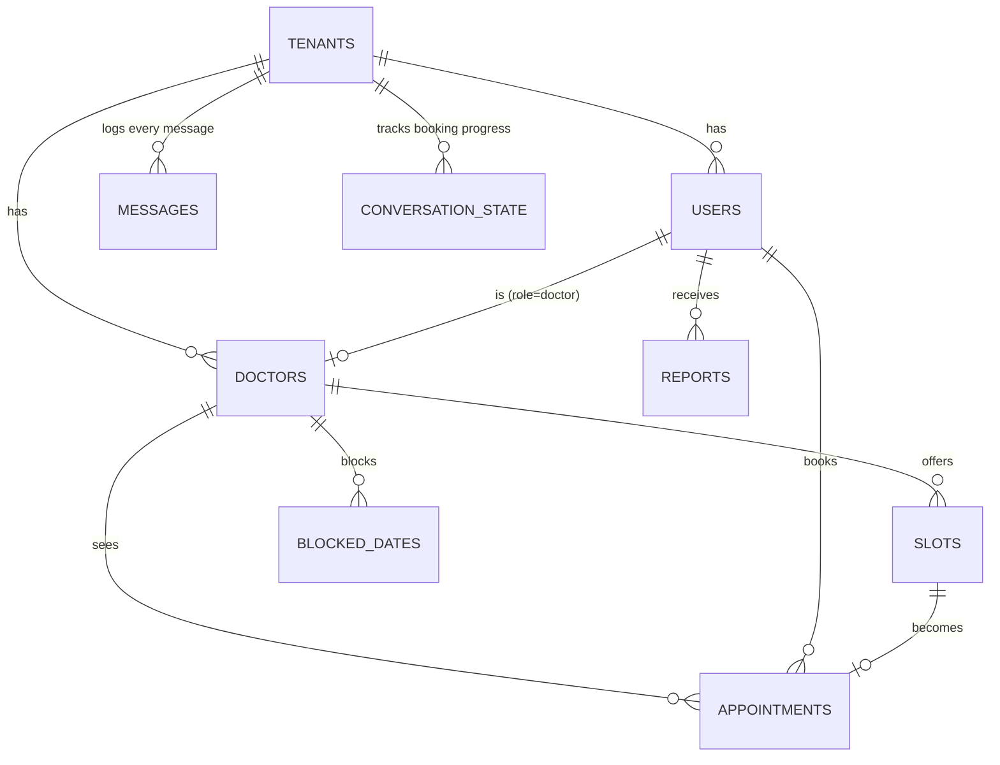

# How This Works

A WhatsApp-only clinic appointment system. Patients, doctors, and receptionists never
use an app or website — everything happens by texting the clinic's WhatsApp number.
One backend serves many clinics (tenants); each clinic has its own WhatsApp number.

## 1. Big picture



Everything the app "does" is either:
1. **React to an inbound WhatsApp message** (booking bot or staff commands), or
2. **React to time passing** (a queued job firing — a reminder, a report, a daily summary).

## 2. Components, one line each

| Component | What it does |
|---|---|
| `components/whatsapp` | The only door in and out. Receives Meta's webhook, verifies its signature, figures out which clinic and which person sent it, logs every message, and is the one place that actually calls the WhatsApp send API. |
| `components/booking` | The patient-facing chatbot. A step-by-step ladder (language → doctor → date → time → details → confirm) that ends in a real appointment. |
| `components/staff` | The receptionist/doctor command parser. Plain-text commands like `TODAY` or `DONE 3`. |
| `components/doctors` | Doctor lookups — by id, by user account, by fuzzy name match (for staff commands). |
| `components/slots` | Generates and lists bookable time slots for a doctor. |
| `components/appointments` | Creating, listing, and changing the status of appointments (the token-number logic lives here). |
| `components/reports` | Queues a staff-uploaded PDF for delivery to a patient. |
| `components/notifications` | Doctor-facing alerts: instant "new booking" pings and the 8 AM daily summary. |
| `lib/db` | Database models (Drizzle ORM) + migrations + the seed script. |
| `lib/bull` | Redis/BullMQ plumbing shared by all three queues. |

Everything above is wired together in `src/index.ts` — it's the only file that imports
every component, and it's a handful of lines that just says "here are the workers,
here's the scheduler, here's the server."

## 3. How a WhatsApp message travels through the system



Two things worth calling out:
- **The 200 OK happens before any of the real work.** Meta requires a fast ack; if we
  answered slowly (or with an error) it would just re-send the whole payload. So we ack
  first, then process — and if a step fails, it's retried once internally and logged,
  never silently dropped.
- **Same door, two destinations.** A doctor and a patient text the exact same `/webhook`
  URL. The only difference is what role their phone number is registered under for that
  clinic — that's what decides whether they land in the booking bot or the command parser.

## 4. Live example: booking an appointment

This is an actual conversation, verified end-to-end against the running app.

```
Patient: Hi
Bot:     Welcome! Please select your language:
         1. English
         2. Assamese (অসমীয়া)

Patient: 1
Bot:     What would you like to do?
         1. Book an appointment
         2. View my upcoming appointments

Patient: 1
Bot:     Please choose a doctor by number:
         1. Dr. Asha Verma (General Physician)

Patient: 1
Bot:     Please choose a date by number:
         1. Mon, 03 Aug 2026
         2. Tue, 04 Aug 2026
         3. Wed, 05 Aug 2026
         ...

Patient: 3
Bot:     Please choose a time slot by number:
         1. 09:00 AM
         2. 09:15 AM
         ...

Patient: 1
Bot:     What is the patient's full name?

Patient: Future Patient
Bot:     What is the patient's age?

Patient: 40
Bot:     Please briefly describe the reason for the visit.

Patient: Checkup
Bot:     Please confirm your appointment:
         Doctor: Dr. Asha Verma
         Date: Wed, 05 Aug 2026
         Time: 09:00 AM
         Patient: Future Patient
         Age: 40
         Reason: Checkup

         Reply YES to confirm, or CANCEL to cancel.

Patient: yes
Bot:     Your appointment is confirmed!
         Token number: 1
         Doctor: Dr. Asha Verma
         Date: Wed, 05 Aug 2026
         Time: 09:00 AM

         Please arrive 10 minutes early.
```

The moment "yes" lands, three things happen in the same beat: the appointment row is
created, the time slot flips from `available` to `booked`, and — as covered next — a
reminder gets scheduled and the doctor gets pinged.

At any point before "yes", typing **`cancel`** stops the flow and resets it. Typing
anything invalid (e.g. a name instead of a number) just re-shows the same question —
nothing is lost, nothing advances.

Staff see it from the other side. The receptionist's phone, texting the same number:

```
Receptionist: TODAY
Bot: Today's appointments (1):
     #1 Dr. Asha Verma — Future Patient at 09:00 AM [BOOKED]

Receptionist: DONE 1
Bot: Token #1 marked as completed.
```

## 5. The queue system (BullMQ + Redis)

Three queues, each with one job:



**Reminders — the interesting one.** When a booking is confirmed, we don't send the
reminder right away — we schedule a *delayed* job to fire exactly 24 hours before the
appointment:



If the booking itself happens *less than 24 hours* before the appointment (e.g. someone
books an evening slot for the next morning), there's no sensible "24 hours before"
moment left — the reminder is skipped rather than firing late or immediately.

The clinic's own timezone is used for this math (not the server's), so "24 hours before
09:00 AM" is correct wherever the clinic actually is.

**Reports.** A receptionist attaches a PDF with the caption `REPORT <phone number>`.
That queues a `deliver-report` job, which sends the PDF on to the patient. If sending
fails (network hiccup, bad WhatsApp API response), BullMQ retries automatically — after
3 failed attempts it gives up and the report is marked `failed` rather than retrying
forever.

**Notifications.** Two flavors, one worker: an instant "you have a new booking" ping the
moment a patient confirms, and a recurring 8 AM message that gives each doctor their
whole day's list at once.

## 6. The data, in one picture



- **`slots`** are concrete, one-per-time-slot rows (not a recurring rule) — generated in
  bulk by the `SLOT` staff command.
- **`conversation_state`** is the "memory" of the booking bot — one row per patient,
  holding which step they're on and everything they've picked so far.
- **`messages`** is a full audit log of every inbound and outbound WhatsApp message, for
  every clinic.

## 7. Staff commands, quick reference

| Command | Does |
|---|---|
| `TODAY` | List today's appointments (a doctor sees only their own; a receptionist sees everyone's) |
| `DONE <token>` | Mark an appointment completed |
| `NOSHOW <token>` | Mark an appointment as a no-show |
| `CANCEL <token> <reason>` | Cancel + free the slot + notify the patient |
| `BLOCK <doctor> <date>` | Take a doctor off the schedule for a day; cancels + notifies anyone already booked |
| `SLOT <doctor> <days> <start> <end> <duration>` | Generate new bookable time slots |
| Attach a PDF, caption `REPORT <phone>` | Queue that PDF for delivery to that patient |

That's the whole system: one webhook in, one webhook worth of logic that either talks to
a patient or a staff member, and three background queues that handle everything that
needs to happen *later* instead of *right now*.
