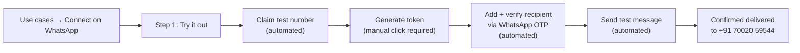
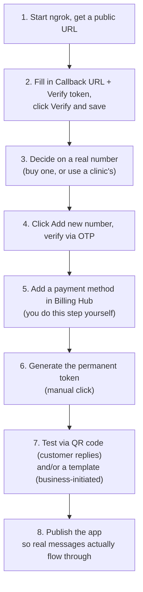

# Meta App — Test WhatsApp Number, Set Up Live

This logs exactly what was done in the Meta Developer dashboard to get a real (test-mode)
WhatsApp number talking to a real phone, and how to repeat or continue from here. This is
the practical follow-up to `WHATSAPP_BUSINESS_SETUP.md` — that file explains the concepts,
this one records what was actually clicked.

## What was done

1. Found where the "WhatsApp API Setup" panel actually lives on the current Meta dashboard
   layout (it's not a top-level sidebar item like older guides describe — it's nested under
   **Use cases → Connect on WhatsApp**).
2. Agreed to the WhatsApp Business Platform terms and claimed a free **test phone number**
   for the app.
3. Generated a **temporary access token** (valid 24 hours) for that test number.
4. Added a real Indian number (**+91 70020 59544**) as an approved test recipient — this
   required verifying it with a one-time code Meta sent over WhatsApp.
5. Sent a real templated test message ("Order Confirmation" — Meta's built-in sample
   template, not this project's own template) from the test number to that recipient, and
   confirmed it arrived.

This proves the entire path works: **Meta account → app → WhatsApp product → test number →
real phone**, before spending any money or involving a real clinic.

## What you now have

| Thing | Value |
|---|---|
| Test WhatsApp number | +1 (555) 200-0610 |
| Phone Number ID | `1209654505573202` |
| WhatsApp Business Account ID | `1013072228161899` |
| Access token | Generated, visible in the dashboard — **not recorded here**, see note below |
| Verified test recipient | +91 70020 59544 |

**On the access token:** it's a secret credential (like a password) — it was deliberately
left out of this file and never written to disk by the assistant. It's still visible on the
dashboard screen (**Use cases → Connect on WhatsApp → Step 1. Try it out**) if you need to
copy it. It expires in 24 hours, so it's only useful for this kind of manual testing, not
for wiring into the app yet.

## How to get back to this screen

```
developers.facebook.com → My Apps → ClinicConnect
  → Use cases (left sidebar)
  → Connect on WhatsApp → Step 1. Try it out
```

Direct URL (this app):
```
https://developers.facebook.com/apps/2205225663663126/use_cases/customize/api-testing-v2/?use_case_enum=WHATSAPP_BUSINESS_MESSAGING&product_route=whatsapp-business&selected_tab=api-testing-v2
```

## Why "Generate token" had to be clicked manually

Automated clicking (via browser automation) worked for every step on this page **except**
"Generate token" — that specific click never fired a network request, with no error and no
visible dialog. Everything else (claiming the number, adding/verifying a recipient, sending
the message) worked fine via automation. Meta most likely blocks scripted interaction
specifically with token-generation, since it's the one action that mints a live credential.
Lesson for next time: expect to click "Generate token" (and anything similarly
credential-related) by hand.



## What's next (not done yet)

This is still **test mode** — a Meta-owned number, a 24h token, and a 5-recipient cap. To
actually onboard a real clinic, the remaining steps from `WHATSAPP_BUSINESS_SETUP.md` still
apply. `WhatsApp → Step 2. Production setup` breaks this into four sub-tasks — here's
exactly what's inside each one, in the order to do them.

### Step 2, sub-task 1 — Configure Webhooks

Two fields:

| Field | What it is | What to put |
|---|---|---|
| **Callback URL** | "The URL Meta will be sending the events to" (their tooltip, verbatim) | Your server's public `/webhook` URL. You haven't deployed yet — since you mentioned **ngrok**, run `ngrok http 3000` (or whatever port your app runs on) and use the `https://xxxx.ngrok-free.app/webhook` URL it gives you. |
| **Verify token** | "This string is set up by you, when you create your webhook endpoint" (their tooltip, verbatim) | Reuse the value already in your `.env` — `WHATSAPP_WEBHOOK_VERIFY_TOKEN`. It just has to match on both sides. |

Click **Verify and save** after both are filled — Meta immediately fires a `GET` at your
callback URL to confirm the handshake, which this project's webhook route already handles.

**Important catch, easy to miss:** right above these fields, Meta shows a warning that says
the app will only receive **test** webhooks from the dashboard while it's unpublished — no
real production messages get delivered until the app is published (there's a "Publish your
app" link right there). So filling in the webhook alone isn't enough to receive real patient
messages — the app also needs to be published before this goes live. That's a separate step
to come back to once everything else here is filled in and tested.

**Ngrok-specific gotcha:** the free ngrok URL changes every time you restart it. If you
reconfigure the webhook once, then restart ngrok later, you'll get a new URL and have to
paste it back into this same "Callback URL" field and re-verify. Fine for testing, but not
something to build a real clinic's launch around — a real deployment (or ngrok's paid static
domain) avoids this.

### Step 2, sub-task 2 — Register your WhatsApp phone number

Meta's own text on this panel: *"Add and verify your business phone number... You can add up
to 2 phone numbers per business. Once you complete business verification, you can add up to
20 numbers."*

- Click **Add new number** to start.
- This is the real "get a number, OTP it" process already described in
  `WHATSAPP_BUSINESS_SETUP.md` Phase 3 — needs an actual number that can receive an SMS or
  voice call right now, whether it's one you bought or a clinic's own.
- **Not done yet** — no real number has been added, only the test number from Step 1 exists.
  This needs an actual phone number decision from you before it can proceed.

### Step 2, sub-task 3 — Add payment to send business-initiated messages

Meta's own text: *"Add a payment method to send business-initiated messages (marketing,
utility and authentication messages). For service messages where you reply to customer
messages, you get 1,000 free user-initiated conversations each month... Manage your payment
method anytime in Billing Hub."*

Translation for this project: your **reminder messages** and **daily doctor summaries** are
sent outside the 24h window, which counts as "business-initiated" (utility templates) — so
this billing step is required before those can actually send. Plain booking-bot replies to
patients (within the 24h window) don't need this at all, and the first 1,000/month of those
are free regardless.

**This step needs to be done by you, not the assistant** — entering a card into Meta's
Billing Hub is a financial-credentials action that's off-limits for the assistant to perform
on your behalf. Navigate to **Billing Hub** (linked right on this panel) and add a card
yourself whenever you're ready to send template messages for real.

### Step 2, sub-task 4 — Send message (the final verification)

This panel has its own two-step flow, separate from Step 1's test token:

- **Step 1: Generate token** — this is the **permanent** access token for production use
  (different from the 24h temporary one from "Try it out"). Same caveat as before: expect to
  click this one by hand too, since automated clicks didn't register on the equivalent
  button earlier.
- **Step 2: Send a message from your registered number** — two tabs:
  - **Customer replies**: scan a QR code with your own phone to simulate a patient messaging
    in first (opens the 24h window, then a free-form reply can be sent back).
  - **Business-initiated messages**: send an approved message template with no prior
    customer message needed — this is the one that needs sub-task 3's payment method set up
    first, and an approved template (see `WHATSAPP_BUSINESS_SETUP.md` Phase 5).
- **Not usable yet** — both tabs need a real registered number selected first (from sub-task
  2, which isn't done), so this step is blocked until that one is.

### Suggested order, given where you are right now



Steps 1–2 can be done right now with no other decisions needed. Steps 3 onward need you to
pick a real phone number first — tell me when you have one and I'll drive the OTP flow the
same way Step 1's test number was set up.

## Do you need to "Publish" the app? — Yes, but not for the reason it sounds like

The Configure Webhooks panel shows a scary-looking warning: *"Apps will only be able to
receive test webhooks... unless the app has been published."* That's real — until the app
is published, only manually-triggered test webhooks reach your server, not messages from
actual patients. So publishing is required before this goes live for real.

**The good news, confirmed by Meta's own App Review documentation:** publishing this app
does **not** require Meta's App Review process. That review exists for apps that access
*other businesses'* WhatsApp data (the Tech Provider / Embedded Signup model this project
deliberately isn't using). Meta's docs state it plainly: *"if you are using the API for
yourself as a Direct Developer, you do not need Advanced access or app review."* Since this
app only ever manages numbers under your own single WABA, it qualifies as a Direct
Developer app — the `whatsapp_business_management` and `whatsapp_business_messaging`
permissions already show status **"Ready for testing"** on the Permissions and Features
page, with nothing pending review.

**What's actually required to publish, checked directly on your dashboard's Publish page
(left sidebar → Publish):**

| Requirement | Current status |
|---|---|
| Privacy Policy URL | ❌ Empty — this is the one real blocker right now |
| Use case review (WhatsApp permissions) | ✅ Already "Ready for testing" — no action needed |

The **Publish** button on that page is greyed out specifically because of the missing
Privacy Policy URL. Terms of Service and a Data Deletion Instructions URL are already filled
in (currently pointing at a placeholder `https://www.facebook.com/` — worth replacing with
your own before this is real, but not what's blocking Publish today).

### How to actually publish, step by step

1. Get a real privacy policy hosted at a real URL — this needs to actually exist and load;
   it can be a simple page, but it can't be fabricated or left as a placeholder for a real
   launch. (This is something you'll want for real anyway once you're handling patient
   data — not just a box to check for Meta.)

   **Already drafted:** `public/privacy-policy/index.html` in this repo — a self-contained
   page (no build step, no external dependencies) covering what India's DPDP Act 2023
   requires plus the WhatsApp/Meta-specific disclosures this product needs. It's served
   automatically at `/privacy-policy/` once the app is running (added
   `express.static("public")` to `app.ts`). Before using the URL for real: replace every
   `[bracketed placeholder]` in the file (Grievance Officer name/email, dates, contact
   email) and host it somewhere with a stable public URL — Netlify Drop or GitHub Pages
   both work for a single static HTML file with zero build setup.
2. Go to **App settings → Basic**, paste that URL into **Privacy policy URL**, save.
3. Go to **Publish** (left sidebar), the button should now be enabled — click **Publish**.

Once published, real inbound messages start reaching your webhook — which at that point
needs to be a real, always-on public URL (not an ngrok tunnel that dies when your laptop
sleeps), matching what's covered in Step 2 sub-task 1 above.
