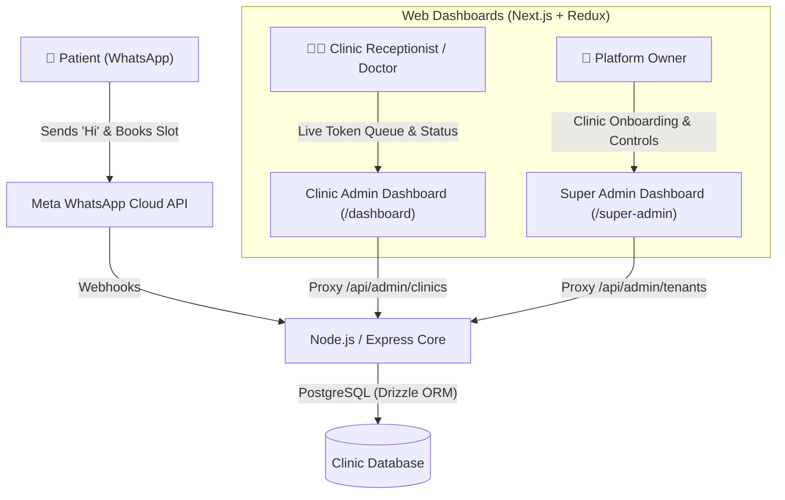
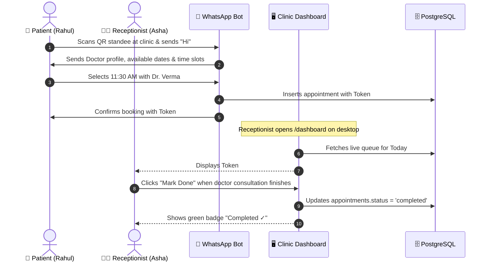
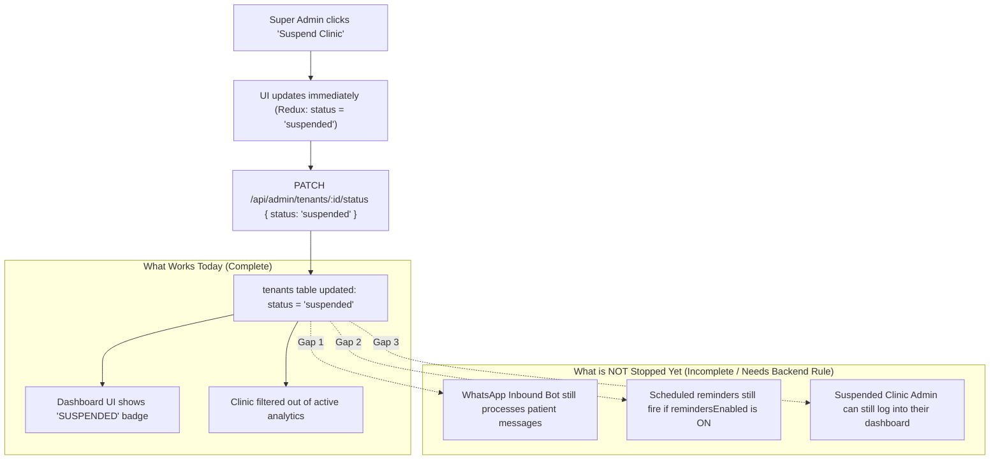

# ClinicConnect Web Dashboard — Operational & Architectural Guide

## 1. What is the Web Dashboard & Why is it Needed?

### The Core Problem
The core engine of this platform allows patients to book doctor appointments by simply sending a message like `"Hi"` to a clinic's WhatsApp number. 

However, **WhatsApp alone is not enough to run a healthcare practice or manage a multi-clinic SaaS**:
1. **Receptionists cannot run an OPD on a mobile chat window**: A busy reception desk cannot scroll through dozens of WhatsApp chat threads to figure out whose turn it is, who didn't show up, or how many patients are waiting in the clinic lobby.
2. **Doctors need structure, not spam**: Doctors need an ordered, live token list with patient age, complaints, and timings, updated in real time.
3. **Platform owners (Super Admins) need multi-tenant governance**: As the SaaS provider selling this system across clinics in Assam and Northeast India, you need a central command center to onboard clinics, generate printable QR standees, toggle automated background reminders, and suspend non-paying clients.

### The Solution: Two Dedicated Dashboards
The Web Dashboard is divided strictly by role:
- **Clinic Admin Dashboard (`/dashboard`)**: Built for clinic receptionists and doctors for daily queue operations and token management.
- **Super Admin Dashboard (`/super-admin`)**: Built for you (the SaaS owner) to govern all clinics, configure settings, and handle tenant lifecycles.



---

## 2. Super Admin Dashboard (`/super-admin`)

The Super Admin Dashboard is the control cockpit for the entire platform. Only users with the role `super_admin` can access these screens and endpoints.

### What Super Admin Currently Does

#### A. Central Clinic Roster & Overview
- Displays all registered clinics across the platform.
- Shows real-time status badges: **Active** (green) vs **Suspended** (amber/red).
- Shows clinic WhatsApp display number, primary doctor name, and specialization.
- Instant search bar to filter clinics by name or phone number.

#### B. 1-Click Clinic Onboarding (Modal)
When you close a sale with a doctor or clinic owner:
1. Super Admin clicks **"+ Add New Clinic"**.
2. Fills in:
   - Clinic Name (e.g., `Brahmaputra Health Clinic`)
   - WhatsApp Display Number (e.g., `+91 98765 43210`)
   - WhatsApp Phone Number ID (Meta Graph API ID)
   - Doctor Name (e.g., `Dr. Dipankar Sarma`)
   - Specialization (e.g., `Cardiologist`)
3. **Automated Backend Creation**:
   - Creates the `tenants` record.
   - Creates the `users` (doctor) record and links the `doctors` profile.
   - Automatically provisions a clinic admin account in `admin_users` (e.g., `admin@brahmaputrahealthclinic.com` with default password `Password@123`).
   - Immediately generates a dedicated WhatsApp Click-to-Chat deep link (`https://wa.me/...`).

#### C. Automated Reminder & Notification Toggles
Each clinic card has independent switches:
- **24h Patient Reminders**: Controls whether scheduled BullMQ jobs send WhatsApp reminders to patients 24 hours prior to their appointment.
- **Doctor Daily Alerts**: Controls whether the morning summary and new booking alert templates are dispatched to the doctor.

#### D. QR Code & Standee Generator
- Opens an interactive modal for any clinic with:
  - High-resolution QR code preview.
  - Formats: Download clean PNG or SVG.
  - "Print Poster" option: Generates a ready-to-print 3-step guide for patients (*"Scan QR -> Send Hi -> Pick Time"*).

---

## 3. Clinic Admin Dashboard (`/dashboard` & `/dashboard/qr`)

The Clinic Admin Dashboard is tailored specifically for the day-to-day front desk and consultation room operations.

### What Clinic Admin Currently Does

#### A. Live OPD Queue Board
- **Token-based list**: Shows all patients booked for the selected day in order of their assigned token number (`#1`, `#2`, `#3`...).
- **Patient Details**: Name, Age, WhatsApp Phone Number, Slot Time (e.g., `10:15 AM`), and Reported Complaint (e.g., `"Fever and cough for 3 days"`).
- **Date Selector Tabs**: Switch between **Today**, **Tomorrow**, and **Day 3** to review future workload.
- **Summary Metrics**: Quick counters for Total Booked, Waiting, Completed, and No-Show.

#### B. Live Status Management
Receptionists or doctors click action buttons directly on the queue card:
- **"Mark Done ✓"**: Changes status to `completed`. The card visually turns green with a checkmark.
- **"No Show"**: Changes status to `noshow`. The card turns muted/red.
- *Architecture note*: Updates Redux state optimistically so the UI feels instantaneous, while simultaneously sending a `PATCH /api/admin/appointments/:id/status` request to PostgreSQL.

#### C. Clinic Reception QR & Standee Page (`/dashboard/qr`)
- Dedicated sub-page where clinic staff can download their custom QR poster or send the link to a local printer for reception table standees.

---

## 4. End-to-End Real-Life Scenarios

### Scenario 1: A Patient Visits Sunrise Clinic (Guwahati)



---

## 5. Flow Audit: What is 100% Complete vs What is Incomplete

To ensure total transparency, here is the exact technical reality of each flow based on the current codebase:

### 1. The Queue & Appointment Flow
* **Status**: **100% Complete**
* **How it works**: When patients book via WhatsApp, the appointment is saved in PostgreSQL (`appointments`). The clinic dashboard calls `GET /api/admin/clinics/:tenantId/queue?date=YYYY-MM-DD` and renders the tokens. When clinic staff clicks "Mark Done" or "No Show", `PATCH /api/admin/appointments/:id/status` persists it directly. Clinic Admins are restricted by backend middleware so they cannot inspect or edit other clinics' queues.

### 2. The Clinic Onboarding Flow
* **Status**: **100% Complete**
* **How it works**: Super admin submits the form -> backend creates tenant record -> creates doctor user & profile -> inserts `admin_users` record with bcrypt hash -> returns generated QR paths and wa.me deep links.

### 3. The Reminder & Notification Toggle Flow
* **Status**: **100% Complete**
* **How it works**:
  - Toggling **24h Reminders** sets `tenants.reminders_enabled = false`. When the background BullMQ `reminder-worker` runs to send WhatsApp templates, it checks `if (!tenant.remindersEnabled) return;`. If disabled, it drops the reminder immediately.
  - Toggling **Doctor Alerts** sets `tenants.notifications_enabled = false`. The `notification-worker` explicitly checks `if (!tenant.notificationsEnabled) return;` for both morning summaries and real-time booking alerts.

---

### 4. The Clinic Suspension Flow
* **Status**: ⚠️ **Partially Complete (Important Reality Check)**

Here is exactly what currently happens when a Super Admin clicks **"Suspend Clinic"**:



#### Detailed Gap Breakdown for Suspension:
1. **WhatsApp Bot Inbound (`handle-inbound-message.ts`)**:
   - *Current Code*: Resolves the tenant by `phoneNumberId`, but does **not** check `tenant.status === 'active'`.
   - *Current Behavior*: If a clinic is suspended in the dashboard, patients who message that clinic's WhatsApp number will still receive automated booking menus.
   - *What needs to be added*: An early guard in `processInboundMessage`:
     ```ts
     if (tenant.status !== "active") {
       logger.info("Ignoring message for non-active tenant", { tenantId: tenant.id });
       return;
     }
     ```
2. **Clinic Admin Login & Token Verification (`get-admin-by-id.ts` & `login.ts`)**:
   - *Current Code*: The login service checks `adminUsers.status !== 'active'`, but when a tenant is suspended, only `tenants.status` is changed; `admin_users.status` is currently untouched.
   - *Current Behavior*: A receptionist or clinic admin can still log into `/dashboard` unless the backend middleware verifies the parent tenant's status as well.
   - *What needs to be added*: Middleware check:
     ```ts
     // In requireAdminAuth or getAdminById:
     if (adminUser.tenantId && tenant.status !== "active") {
       return res.status(403).json({ error: "Clinic account is suspended" });
     }
     ```
3. **Queue Workers (`reminder-worker.ts`)**:
   - *Current Code*: Checks `tenant.remindersEnabled`, but does not verify `tenant.status === 'active'`.

---

## 6. Summary Comparison Table

| Feature | Role | Implementation Status | What Works | What is Pending |
|---|---|---|---|---|
| **Live Queue View** | Clinic Admin | ✅ Complete | Dynamic token list, date filters, patient details | None |
| **Mark Done / No-Show** | Clinic Admin | ✅ Complete | Optimistic UI + PostgreSQL status persistence | None |
| **Printable Standee / QR** | Both | ✅ Complete | SVG/PNG download, wa.me deep links | None |
| **Clinic Registration** | Super Admin | ✅ Complete | Multi-table provisioning + admin user seed | None |
| **Kill-Switch (Reminders)** | Super Admin | ✅ Complete | BullMQ worker checks `remindersEnabled` before sending | None |
| **Kill-Switch (Alerts)** | Super Admin | ✅ Complete | BullMQ worker checks `notificationsEnabled` before sending | None |
| **Clinic Suspension** | Super Admin | ⚠️ Partial | Database flag updates, UI badges update | WhatsApp bot & Clinic Admin login must be gated by `tenant.status` |

---

## 7. Recommended Next Step
To make the **Clinic Suspension Flow 100% complete**, we should:
1. Add `if (tenant.status !== 'active') return;` inside `src/components/whatsapp/services/handle-inbound-message.ts`.
2. Add tenant status verification inside `src/components/admin/middleware.ts` so suspended clinics are immediately logged out and blocked from viewing the queue.
3. Check `tenant.status === 'active'` in `reminder-worker.ts` and `notification-worker.ts`.
