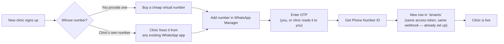

# Getting Real WhatsApp Numbers Working — A Plain-English Guide

This explains, in simple terms, everything that has to happen **outside the code** before
this product can send and receive real WhatsApp messages for a real clinic. None of this
is programming — it's account setup, paperwork, and configuration on Meta's side.

## The model: you manage everything, clinics just chat

Clinics never touch Meta, never sign up for anything, never see a developer dashboard.
**You** own one Meta account, and for every new clinic that signs up, **you** add their
phone number to it — either a number you provide them, or their own existing number.
The clinic's only involvement, ever, is a two-minute phone call if Meta needs to read
you a one-time code.

This turns out to be simpler than the "let clinics self-serve" model I first described,
because of one key fact:

> **One WhatsApp Business Account (WABA) can hold many clinics' phone numbers.**
> You don't need a separate Meta setup per clinic — you need ONE setup, and you just keep
> adding numbers to it as clinics sign up.

- A WABA starts with room for **2 phone numbers**, and Meta **automatically raises that
  to 20** once your business is verified. Beyond 20, you can request more directly from
  Meta as you grow.
- **Message templates are shared across the whole WABA.** Approve your "appointment
  reminder" template *once*, and every clinic's number under that WABA can use it
  immediately — no re-approving per clinic.
- There's **one webhook URL per WABA**, no matter how many numbers it holds. That's not
  a problem here — this project's `/webhook` already figures out which clinic a message
  belongs to from the `phone_number_id` inside the payload, not from the URL. Every
  clinic's number points at the exact same webhook.

## Glossary — the confusing names, explained simply

| Term | What it actually means |
|---|---|
| **Meta Business Account** | Your company's profile on Facebook's business side. You create **one, ever**. |
| **Meta Developer App** | The "robot" that's allowed to talk to WhatsApp's servers on your behalf. Also **one, ever**. |
| **WhatsApp Business Account (WABA)** | A shared folder holding **many clinics'** phone numbers and the templates they all use. In this model, you create **one WABA total**, not one per clinic. |
| **Phone Number ID** | An internal ID Meta assigns to each number added to your WABA. This is exactly the `whatsapp_phone_number_id` column already in the `tenants` table — one per clinic row. |
| **Access Token** | The "password" your server uses when calling WhatsApp's API. **One token works for every number** under your WABA — you don't generate a new one per clinic. |
| **Message Template** | A pre-written, pre-approved message format (e.g. "Reminder: your appointment is tomorrow"). Required for messages sent outside a live conversation. Shared across the whole WABA. |
| **24-hour (service) window** | Once a patient messages the clinic, you can reply with anything, for free, for 24 hours. After that, only an approved template works. |

## Phase 1 — Set up your own Meta account and app (do this once, ever)

This is the foundation everything else sits on.

1. Go to **developers.facebook.com** and log in with a Facebook account (create a
   dedicated business one if you don't want to use a personal account).
2. Click **My Apps → Create App**. Choose the **"Connect with customers through
   WhatsApp"** option when asked what your app does.
3. Give it a name (e.g. "ClinicConnect") and an email, and create it.
4. Inside the app, Meta gives you a **test WhatsApp Business Account** automatically,
   with:
   - A free **test phone number** (Meta's own, not yours — good enough for the next step)
   - A **Phone Number ID**
   - A **temporary access token** (expires in 24 hours — fine for testing, not for real use)
5. Using that test number, send yourself a test message from the dashboard. If you get
   it on your phone, the whole pipe works end to end.

At this point you have a working sandbox — no real clinic number yet, but you've proven
the connection works. **This WABA is the one you'll keep adding every clinic to** — you
won't create another one later.

## Phase 2 — Generate your one permanent access token (do this once, ever)

Before onboarding any real clinic, swap the 24-hour temporary token for a permanent one
that works for every number you'll ever add.

1. Go to **Business Settings → Users → System Users**.
2. Create a System User, and give it access to your app and your WABA.
3. Generate a token for it with the `whatsapp_business_messaging` and
   `whatsapp_business_management` permissions. This token **doesn't expire** — it's what
   goes into `WHATSAPP_ACCESS_TOKEN`, and it will work for every clinic's number you add
   later, since they all live under the same WABA.
4. Point the **webhook URL** (Meta calls this "Configuration → Webhook") at your server's
   public `https://yourdomain.com/webhook`, and enter the same verify token your app
   already expects (`WHATSAPP_WEBHOOK_VERIFY_TOKEN`). Meta immediately calls your
   `GET /webhook` to check it — this project's code already handles that handshake.
   You only ever configure this **once**, for the whole WABA — every clinic added later
   automatically uses it too.

## Phase 3 — Onboard a new clinic (repeat this for every clinic that signs up)

This is the only step that happens over and over. Everything above was one-time setup.

1. **Get a number that can currently receive an SMS or a voice call.** Two options,
   both fine:

   | | You provide the number | Clinic gives you their number |
   |---|---|---|
   | Effort | Buy a cheap virtual/VoIP number just to receive one OTP — after that, no physical phone or SIM is ever needed again (it's the Cloud API, no app running anywhere) | Clinic must first free that number from any personal/WhatsApp Business app already using it (or use Meta's **Coexistence** mode to let them keep both) |
   | Clinic's involvement | None | A short call to relay you the OTP code Meta sends them |
   | Best for | Clinics with no attachment to a specific number | Clinics who already advertise a number to patients |

2. In **WhatsApp Manager → Phone Numbers**, click **Add phone number**, and enter it.
3. Meta sends a one-time code by SMS or voice call — enter it (you receive it directly
   if you own the number, or the clinic reads it to you over a quick call).
4. Meta gives you that number's **Phone Number ID**. This goes straight into a new row
   in the `tenants` table — that's the whole hookup, nothing else to configure per
   clinic (same access token, same webhook, both already set up in Phases 1–2).
5. Add that clinic's doctor(s) and receptionist as `users` rows, generate their slots,
   and the clinic is live.



Notice what does **not** appear anywhere in this list: no new Meta app, no new WABA, no
new access token, no new webhook config, and no involvement from Meta's app-review
process. All of that was one-time work in Phases 1–2.

## Phase 4 — Business verification (once, unlocks scale for every clinic at once)

New numbers start heavily restricted (very low daily messaging limits, capped at 2
phone numbers per WABA). Verifying your business with Meta removes both caps —
**one verification, and every current and future clinic under your WABA benefits**.
You'll need:
- Your legal business name, address, phone, email, and website — all matching exactly
- An official document proving the business is real: a certificate of incorporation,
  business license, or (in India specifically) a **GST certificate**
- Someone with admin access to your Meta Business Manager to submit it

This isn't required just to *test* — only to unlock full messaging volume and go past
2 numbers.

## Phase 5 — Message templates (approve once, every clinic can use it)

WhatsApp lets a business send **anything** for free, for 24 hours after a customer
messages them. Reply to "Hi" within a day — fine, no template needed. But this
product's **reminders** (sent the day *before* the appointment) and **daily doctor
summaries** happen outside that window on purpose — and outside that window, Meta
**requires** a pre-approved template message, or the send is rejected outright.

The good news: appointment reminders are one of the most standard, fastest-approved
template types there is (category: **Utility** — non-promotional, informational). And
because templates are shared across your whole WABA, you only ever submit each one
**once**, for all clinics combined — not once per clinic. This project's actual
reminder text turns into a template almost exactly as-is:

**What the code sends today (free text, works only within the 24h window):**
```
Reminder: You have an appointment with Dr. Asha Verma
on Wed, 05 Aug 2026 at 09:00 AM (Token #1).
```

**What it needs to become (an approved template, with `{{1}}`-style placeholders for the changing parts, reused by every clinic):**
```
Reminder: You have an appointment with {{1}}
on {{2}} at {{3}} (Token #{{4}}).
```

To get this approved: submit it once, under the **Utility** category, through Meta's
WhatsApp Manager, filling in one example value per placeholder (e.g. `{{1}} = Dr. Asha
Verma`). Utility templates like this typically come back approved in **minutes to a
few hours** — nowhere near as strict as marketing templates. Once approved, clinic #2,
#3, and #100 all send this same reminder template — you never touch it again.

The same applies to the **morning doctor summary** — that also needs its own approved
Utility template, submitted once, shared by every clinic.

## Phase 6 — What this actually costs

WhatsApp moved to **per-message pricing** in mid-2025. As of 2026, roughly:

| Type | Cost per message | When it applies |
|---|---|---|
| Reply within 24h window ("service") | **Free** | Booking bot conversations, staff commands |
| Utility template (reminders, summaries) | **~$0.004** | Sent outside the 24h window |
| Marketing template | **~$0.025** | Not used by this product currently |

**Worked example:** say you're running 50 clinics, each averaging 200 appointments a
month — that's 10,000 reminder messages a month, all under your one shared WABA. At
~$0.004 each, that's **~$40/month** in total Meta charges for reminders across all 50
clinics. The actual booking conversations (patients chatting with the bot) are free,
since they're always inside the 24-hour window.

## One thing to keep an eye on as you grow

Messaging-limit scaling now works at the whole-account ("portfolio") level, not purely
per number. So if one clinic's patients start blocking/reporting their number a lot, it
can slow down how fast your **whole** account is allowed to scale — not just that one
clinic. Not a concern at 5 or 10 clinics, but worth monitoring quality ratings per
number as you grow. And once you pass **20 numbers**, you'll need to either request a
higher cap from Meta or start a second WABA (which would mean re-submitting your
templates once for that second WABA, since templates don't carry across WABAs).

## Quick checklist

- [ ] Create a Meta Developer account + app, once (Phase 1)
- [ ] Generate one permanent access token + configure the webhook, once (Phase 2)
- [ ] Verify your business with Meta, once (Phase 4)
- [ ] Submit the reminder message and daily summary message as Utility templates, once (Phase 5)
- [ ] Point the webhook at a real, public `https://` URL (not `localhost`)
- [ ] For every new clinic: get a number → add it in WhatsApp Manager → verify with OTP → create its `tenants` row (Phase 3)

---

### Sources

- [WhatsApp Cloud API Get Started — Meta for Developers](https://developers.facebook.com/documentation/business-messaging/whatsapp/get-started)
- [Register a business phone number — Meta for Developers](https://developers.facebook.com/documentation/business-messaging/whatsapp/business-phone-numbers/registration)
- [WhatsApp Business Accounts — Meta for Developers](https://developers.facebook.com/documentation/business-messaging/whatsapp/whatsapp-business-accounts)
- [Template categorization — Meta for Developers](https://developers.facebook.com/documentation/business-messaging/whatsapp/templates/template-categorization)
- [Messaging Limits — Meta for Developers](https://developers.facebook.com/documentation/business-messaging/whatsapp/messaging-limits)
- [WhatsApp Business API Pricing in 2026 — Blueticks](https://blueticks.co/blog/whatsapp-business-api-pricing-2026)
- [Utility WhatsApp Templates — d7networks](https://d7networks.com/whatsapp-business-api/whatsapp-message-templates/utility-templates/)
- [Meta Business Verification — respond.io](https://respond.io/help/whatsapp/meta-business-verification)
- [Capacity, Quality Rating, and Messaging Limits — 360dialog](https://docs.360dialog.com/docs/waba-management/capacity-quality-rating-and-messaging-limits)
